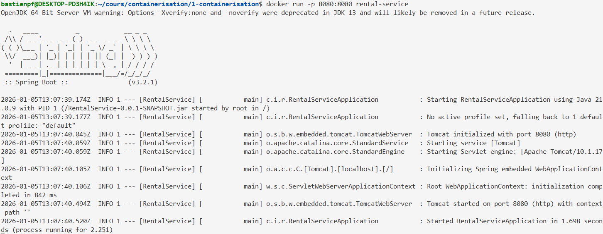
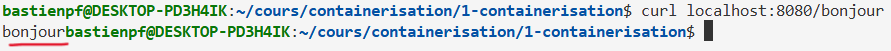
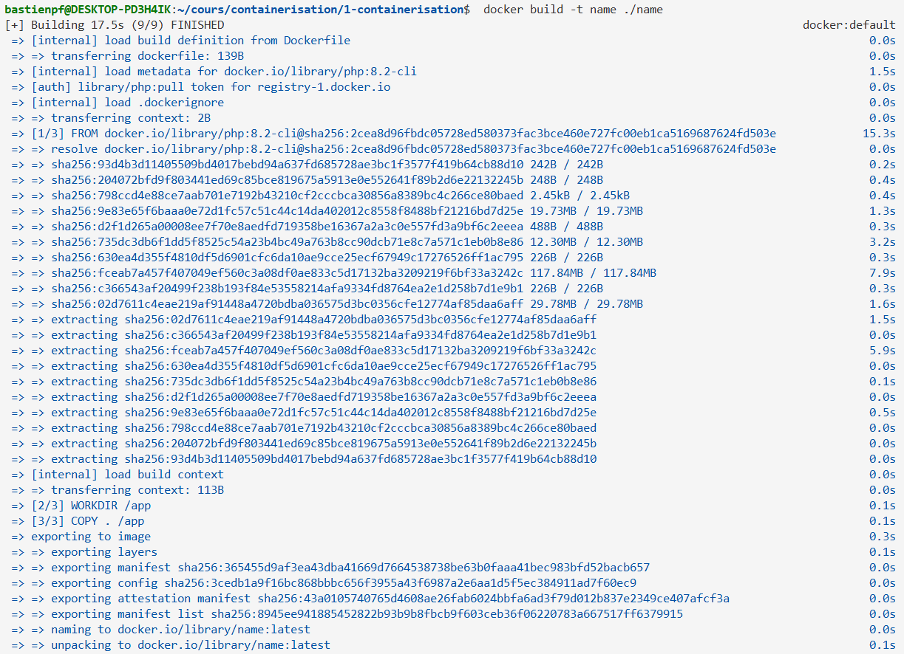
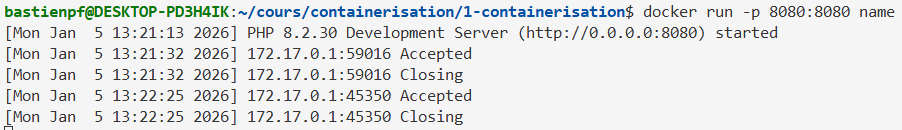
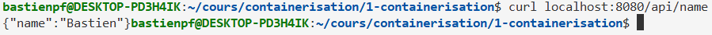

# Projet Docker #1

## Introduction
Ce projet contient deux projet indépendant utilisant des Dockerfile pour fonctionner.

## Rental Service Java

### Initialisation des projet

Pour des raisons d'optimisation de mon espace en local, j'ai voulu build mon application java dans mon container.
J'ai donc modifié le Dockerfile en fonction, pour utiliser gradle 8.5 avec mon jdk 21. Pour l'image java, j'ai utilisé l'image corretta d'amazone : amazonecorretta:21
Je build donc d'abord le projet, puis j'attend que ce build soit completé avant d'executer ma snapshot java.

### Run le projet :

> docker build -t rental-service ./RentalService

*resultat du build*

Puis

> docker run -p 8080:8080 rental-service

*resultat du run*

### Test :
On peut tester la methode "bonjour" de notre projet java pour vérifier que les ports sont mappé correctement et que l'image s'est bien construite (dans un nouveau shell, a moins d'avoir docker run -d) en appelant l'url suivant :

> curl localhost:8080/bonjour

*l'appel renvoit :*

## Microservice en PHP
Mon service PHP dans le dossier "name" permet de renvoyer le prénom "NAME" définit dans le .env en executant une requete http GET /api/name

### Run le projet :

> docker build -t name ./name

*resultat du build*

Puis

> docker run -p 8080:8080 name

*resultat du run*

### Test

> curl localhost:8080/api/name

*resultat de la requete*
