# TP3

## introduction 

Je réutilise le mini projet php avec Dockerfile pour ce projet Kubernetes.
Il est situé dans ./name

## Mise en place
(après installation de minikube)

> minikube start
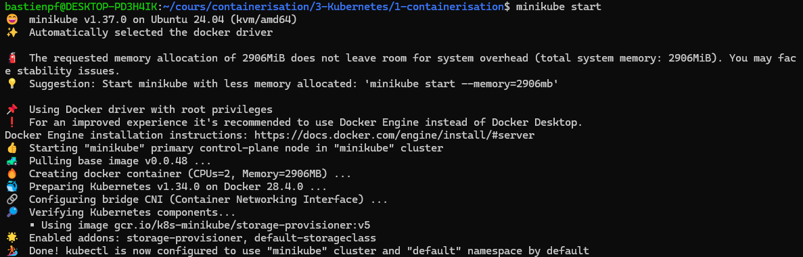

## Create a kubernetes deployment from a Docker image

> kubectl get nodes
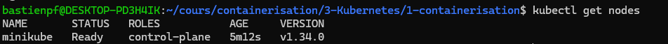

> kubectl create deployment app-php --image=bipief/php-app-simple:1
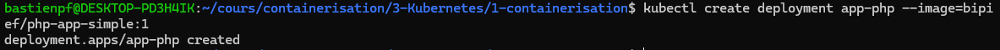

> kubectl get pods
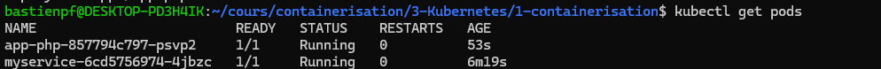

> kubectl describe pods
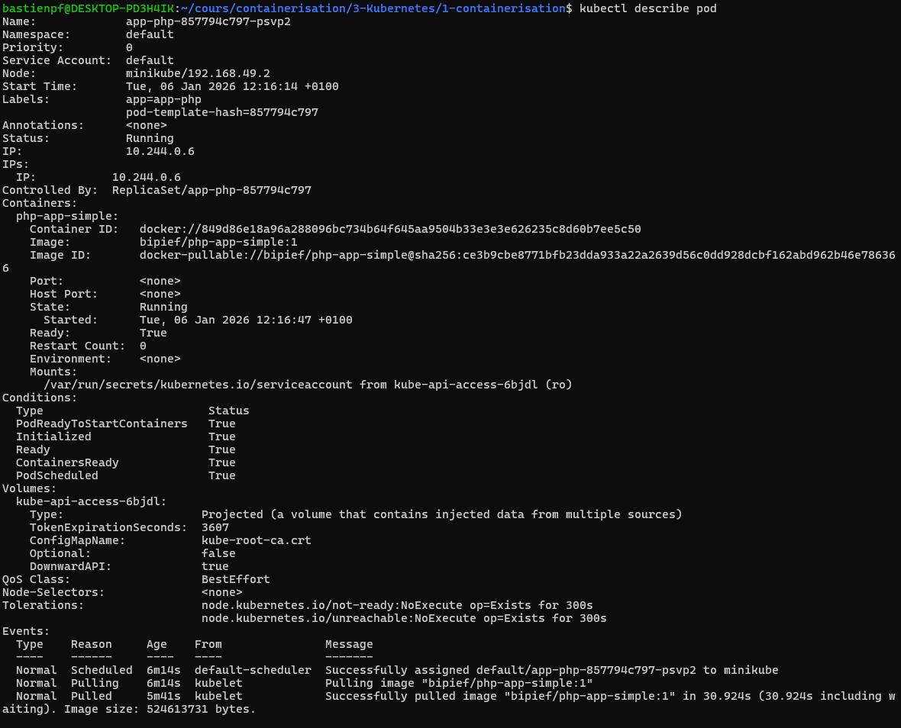

> kubectl exec -it app-php-857794c797-psvp2 -- /bin/bash
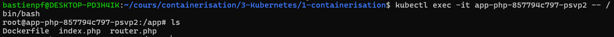

## Expose HTTP and HTTPS routes from outside the cluster to services within the cluster

> kubectl expose deployment app-php --type=NodePort --port=8080
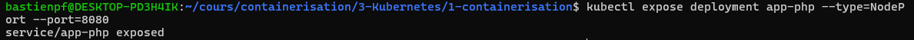

> minikube service app-php --url
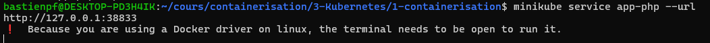
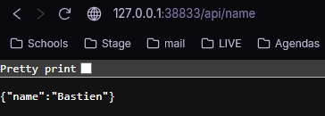

## Scaling and load balancing

> kubectl get deployments

> kubectl get pods
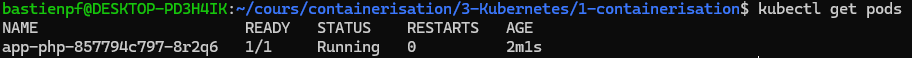

> kubectl scale --replicas=2 deployment/app-php
> kubectl get deployments
> kubectl get pods
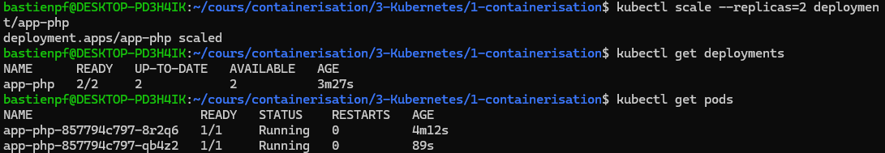

## Creating a Service of type LoadBalancer

> kubectl get deployments
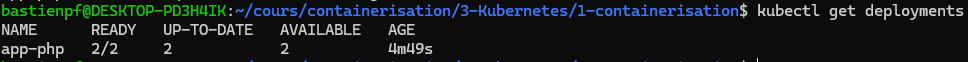

> kubectl get services
> kubectl delete service app-php
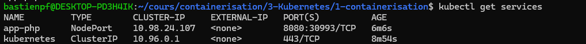
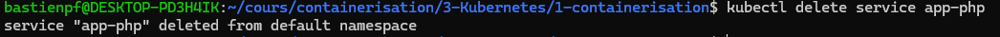

> kubectl expose deployment app-php --type=LoadBalancer --port=8080
> minikube service app-php --url
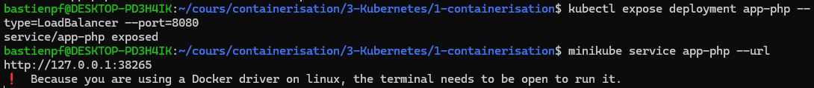

*test in browser*
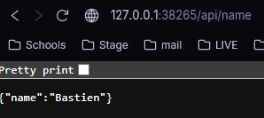

## Rolling updates

> kubectl set image deployments/app-php php-app-simple=bipief/php-app-simple:1
> kubectl rollout status deployments/app-php
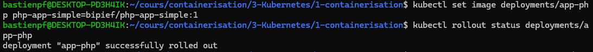

> kubectl rollout undo deployments/app-php
-> doesn't work :
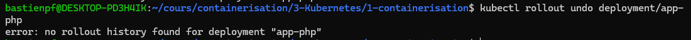

tried :
> kubectl rollout history deployment/app-php
> 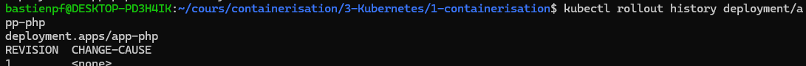
> kubectl rollout undo deployment/app-php --to-revision=0
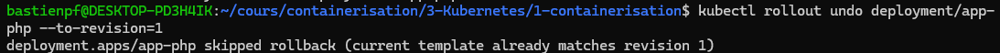

=> Le rollout ne marche pas car il n'y a qu'un seul rollout effectué, sur lequel nous nous trouvons actuellement. On ne peut donc pas revenir sur un rollout plus ancient.

## Create a deployment and a service using a yaml file

I imported and updated the yaml files.

> kubectl apply -f myservice-deployment.yml
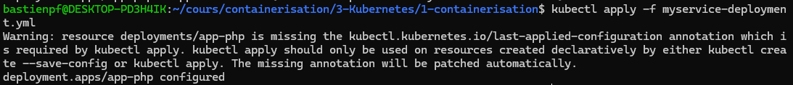

> kubectl apply -f myservice-loadbalancing-service.yml
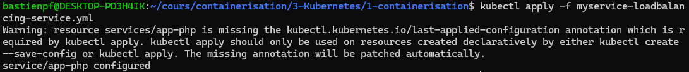

> kubectl get pods
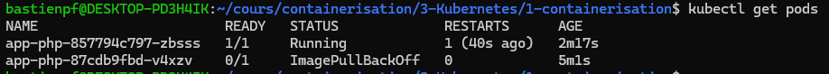

